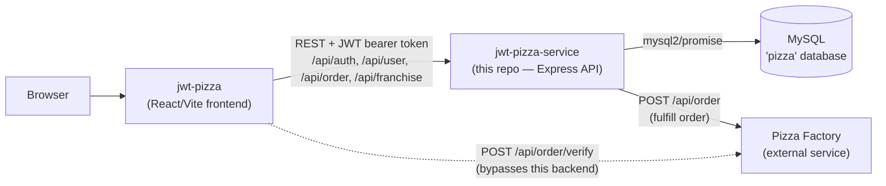
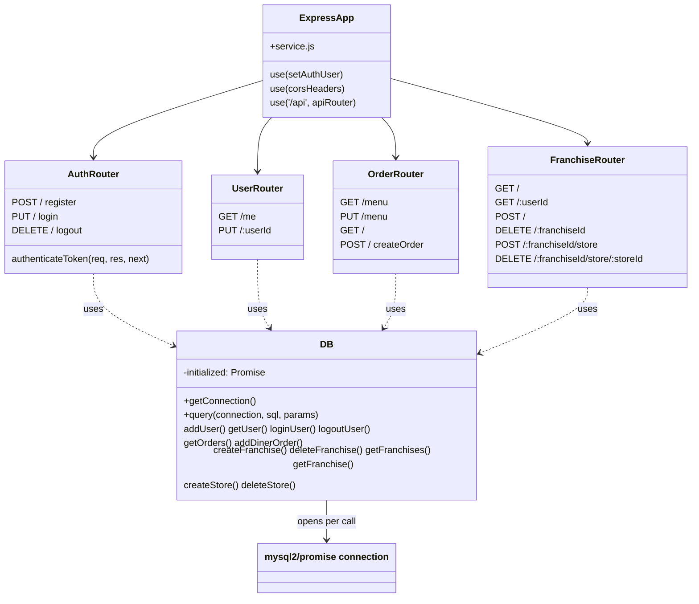
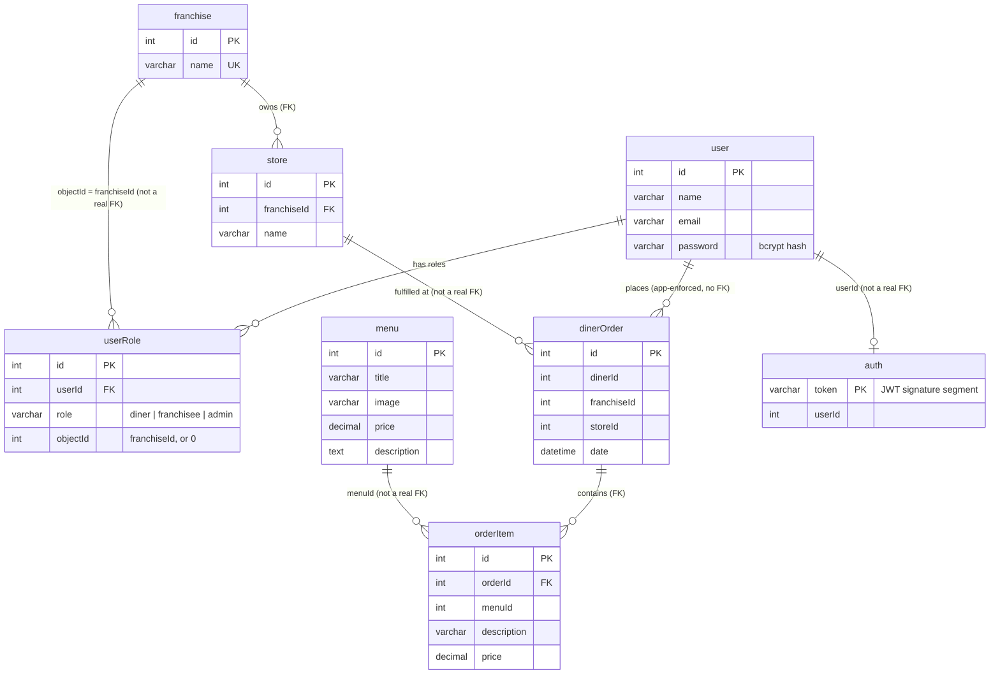
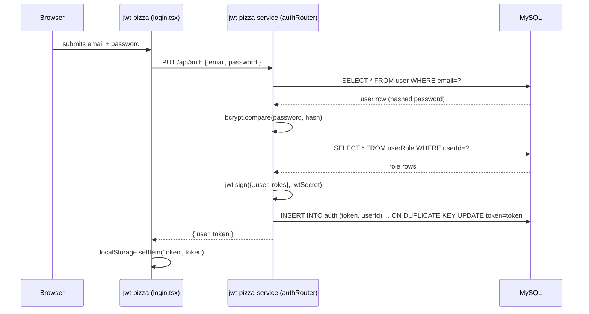

# JWT Pizza — Architecture

This document explains how `jwt-pizza-service` (this repo) fits into the larger JWT Pizza system, how a request flows through the codebase, and how the data model is put together. It's built from reading the actual source, not from the course docs — cross-reference it against the code as you go.

## 1. System context

JWT Pizza is three independently-deployable pieces, not one monolith:

- **`jwt-pizza`** — the React/Vite/TypeScript frontend. Runs entirely in the browser; talks to the backend over plain HTTP/JSON, using a JWT bearer token it keeps in `localStorage`.
- **`jwt-pizza-service`** (this repo) — a single Express process. Owns all business logic, auth, and the MySQL connection. This is the only thing the frontend is supposed to talk to for its own data.
- **The Pizza Factory** — an external service (provided by the course, not in this repo) that actually "makes" an order and can verify a receipt JWT. Notably, the frontend calls it **directly** for verification, skipping this backend entirely — worth remembering when you're debugging and wondering why a breakpoint in this repo never hits.



## 2. Request pipeline inside `jwt-pizza-service`

Everything is wired up in `src/service.js`. A request flows through, in order:

1. `express.json()` — parses the JSON body.
2. `setAuthUser` (`authRouter.js`) — if an `Authorization: Bearer <token>` header is present, checks the token against the `auth` table *and* verifies its JWT signature, then attaches `req.user` (with an `isRole()` helper) if both pass.
3. A CORS headers middleware — allows the frontend's origin.
4. The `/api` router, which delegates to one sub-router per resource.
5. Route-level `authRouter.authenticateToken` middleware, used on any route that requires `req.user` to exist (returns `401` otherwise). Role checks (e.g. "must be Admin") happen inside individual handlers, not as reusable middleware.
6. The route handler calls into the `DB` singleton (`src/database/database.js`), which opens a **new MySQL connection per call** (see §5) and returns plain data.



## 3. Authentication & authorization model

- Passwords are hashed with **bcrypt** (10 rounds) before being stored — never stored or compared in plaintext.
- On register/login, a JWT is signed with `config.jwtSecret`, containing the **entire user object** (id, name, email, roles). Notably, `jwt.sign()` is called with no `expiresIn` — the token itself never expires.
- Revocation is handled *outside* the JWT, in the database: the token's signature segment (`getTokenSignature`) is written to the `auth` table on login. `setAuthUser` requires **both** a valid signature *and* a matching row in `auth` before trusting `req.user`. Logout just deletes that row — that's what actually kills a session, not JWT expiry. This is why "Logout" in your notes table maps to a `DELETE FROM auth`, not anything touching the `user` table.
- Roles (`src/model/model.js`): `diner`, `franchisee`, `admin`, stored per-user in `userRole`. The `objectId` column is overloaded: it's meaningless (`0`) for a diner or admin, but holds the **franchise ID** for a franchisee — that's how "which franchise does this franchisee belong to" is tracked, without a separate table.

## 4. Data model



★ Worth noticing: only `store.franchiseId`, `userRole.userId`, and `orderItem.orderId` are **real, declared `FOREIGN KEY` constraints** in `dbModel.js`. Everything else marked "not a real FK" above (`dinerOrder`'s three references, `orderItem.menuId`, `auth.userId`, `userRole.objectId`) is just a plain `INT` column that the *application code* treats as a reference — MySQL itself won't stop you from inserting a `dinerOrder` with a `storeId` that doesn't exist. That's a real (if minor) data-integrity gap in this schema, useful to know if you ever debug orphaned-data weirdness.

## 5. A concrete walkthrough: login



Every other authenticated request afterward sends `Authorization: Bearer <token>`, and `setAuthUser` re-validates it against the `auth` table on **every single request** — there's no session cache, so a login check is effectively two extra queries (`auth` lookup + implicit `jwt.verify`) on top of whatever the endpoint itself needs.

## 6. Connection handling — no pooling

`DB._getConnection()` calls `mysql.createConnection(...)` fresh, and every method's `finally` block calls `connection.end()`. There is **no connection pool** — each API call opens and tears down its own TCP connection to MySQL. Fine for a class project's traffic levels; worth knowing if you ever load-test this (a later deliverable) and see connection-count-related failures.

## 7. Folder map

```
src/
  index.js              entry point — starts the HTTP server
  service.js            wires middleware + mounts routers (the real "app")
  config.js             DB credentials, JWT secret, Pizza Factory URL (gitignored)
  endpointHelper.js      asyncHandler wrapper + StatusCodeError
  model/model.js         Role enum
  database/
    database.js         DB class — all SQL lives here
    dbModel.js           CREATE TABLE statements
  routes/
    authRouter.js        register / login / logout
    userRouter.js         get/update current user
    orderRouter.js        menu + order placement (calls out to Pizza Factory)
    franchiseRouter.js     franchise + store CRUD
```

## 8. How your local dev environment maps to this

The `docker-compose.yml` at the repo root runs the MySQL box this whole diagram calls "MySQL / 'pizza' database" — `config.js` is what tells `DB._getConnection()` how to reach it (`127.0.0.1:3306`, `root`, matching password). `initializeDatabase()` in `database.js` is what actually runs the `CREATE TABLE` statements from `dbModel.js` against your container on first boot — that's the "Database does not exist, creating it" log line you saw earlier in this session.
